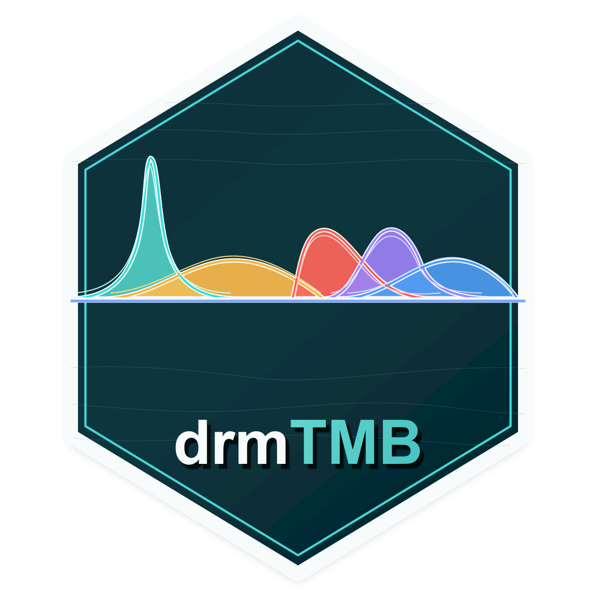

# drmTMB <a href="https://itchyshin.github.io/drmTMB/"></a>

A fast TMB-based distributional regression package for ecological, evolutionary,
and environmental data, focused on univariate and bivariate
location-scale-shape models where not only mu and sigma but also shape, zero
inflation, random-effect variance, and residual correlation `rho12` can be
modelled by predictors.

The current implementation supports Gaussian location-scale models, including
fixed effects and random intercepts in the location formula:

```r
drmTMB(
  bf(y ~ x1 + (1 | id), sigma ~ x1),
  family = gaussian(),
  data = dat
)
```

It also supports the first flagship bivariate location-coscale model, including
predictor-dependent residual correlation:

```r
drmTMB(
  bf(
    mu1 = y1 ~ x1 + x2,
    mu2 = y2 ~ x1,
    sigma1 = ~ x1 + x2,
    sigma2 = ~ x1,
    rho12 = ~ x1 + x2
  ),
  family = biv_gaussian(),
  data = dat
)
```

Future bivariate public syntax should also allow composed response families such
as `family = c(gaussian(), gaussian())` and `family = c(gaussian(), poisson())`
where a coherent joint likelihood is defined.

Diagonal meta-analysis is handled as Gaussian regression with known sampling
variance, not as a separate family:

```r
drmTMB(
  bf(
    yi ~ x1 + x2 + meta_known_V(V = V),
    sigma ~ x1
  ),
  family = gaussian(),
  data = dat
)
```

Current project status: Gaussian location-scale MVP with `mu` random
intercepts, diagonal `meta_known_V(V = vi)` meta-analysis support, and
fixed-effect bivariate Gaussian `rho12 ~ predictors`. The next target is to
harden these likelihoods and then add random slopes, random-effect scale
models, sparse known covariance, phylogenetic A-inverse, and spatial SPDE
paths.
