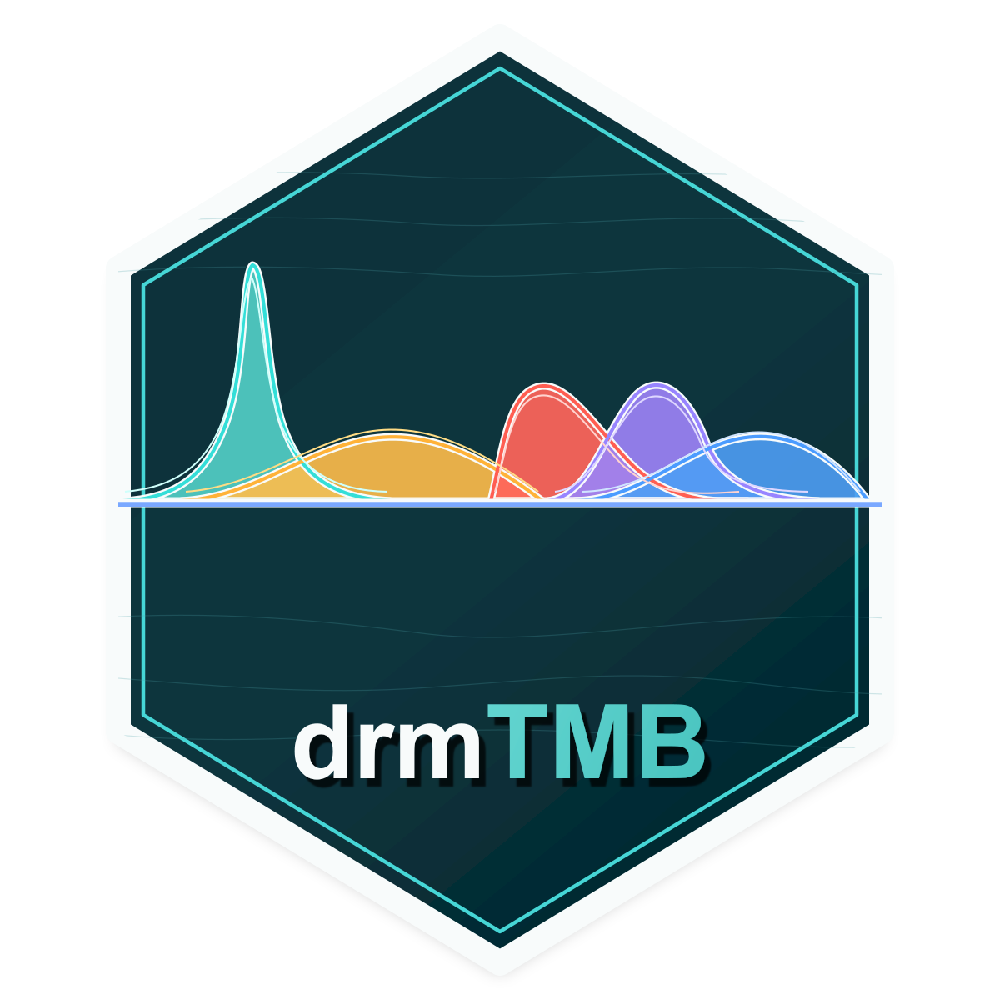

# drmTMB <a href="https://itchyshin.github.io/drmTMB/"></a>

<!-- badges: start -->
[](https://github.com/itchyshin/drmTMB/actions/workflows/R-CMD-check.yaml)
[](https://github.com/itchyshin/drmTMB/actions/workflows/pkgdown.yaml)
[](https://lifecycle.r-lib.org/articles/stages.html#experimental)
<!-- badges: end -->

## Model more than the average

`drmTMB` is an R package that fits **distributional regression models (DRMs)**
for one or two responses. Distributional regression lets predictors change
not only an outcome's average, but also other features of its distribution:
for example, how variable it is or how likely it is to be zero.

Use it for questions such as: does temperature change average growth; is growth
less predictable in one habitat; or, after accounting for their averages and
variability, do two responses still vary together? Examples begin in ecology,
evolution, and environmental science, but the same questions arise in many
applied fields.

> **Experimental software.** Start with a documented example, check the fitted
> model, and read [Capabilities and limits](https://itchyshin.github.io/drmTMB/articles/capability-and-limits.html)
> before reporting a result. A successful fit alone does not validate an analysis.

`drmTMB` 0.7.1 is the development version; 0.7.0 is on CRAN.

## Start with your scientific question

Choose one route. Each begins with a runnable example and tells you what to
check before interpreting the result.

| If your data and question are... | Start here | Important limit |
| --- | --- | --- |
| One response, and predictors may change its average or residual variability | [Distributional regression with drmTMB](https://itchyshin.github.io/drmTMB/articles/drmTMB.html) | Begin with the simplest response family that matches the data; a successful fit still needs `check_drm()`. |
| A trait or response measured across related species, with a tree | [Phylogenetic mixed models](https://itchyshin.github.io/drmTMB/articles/phylogenetic-models.html) | The first worked route is Gaussian and needs repeated observations within species to separate phylogenetic from residual variation. |
| One Gaussian response measured at named sites with coordinates | [Coordinate-spatial structured effects](https://itchyshin.github.io/drmTMB/articles/spatial-models.html) | Start with a coordinate-spatial location intercept. Repeated observations within sites are needed to separate site-level spatial variation from residual variation; range and interval claims are not established by this first route. |
| Effect sizes with known sampling variances or covariance | [Mean effects and residual heterogeneity](https://itchyshin.github.io/drmTMB/articles/meta-analysis.html) | This is a Gaussian known-variance route, not a response-family choice for raw observations. |

For a count, proportion, zero-heavy, robust, bivariate, spatial, pedigree, or
known-matrix analysis, use [What can I fit today?](https://itchyshin.github.io/drmTMB/articles/model-map.html)
to find the relevant guide. Before reporting an estimate or interval, read
[Can I fit and report this model?](https://itchyshin.github.io/drmTMB/articles/capability-and-limits.html).

`drmTMB` uses **Template Model Builder (TMB)** to fit models by default.
`DRModels.jl` is an optional Julia companion. For supported models, the
[Julia engine guide](https://itchyshin.github.io/drmTMB/articles/julia-engine.html)
shows how to select it from R with `engine = "julia"` and explains its limits.
Julia is not required to install or use the default R workflow.

## Install

Install the released version from CRAN:

```r
install.packages("drmTMB")
```

To try development changes before a release, install from GitHub with `pak`:

```r
install.packages("pak")
pak::pak("itchyshin/drmTMB")
```

Then load the package and run a small smoke test:

```r
library(drmTMB)

set.seed(1)
dat <- data.frame(x1 = rnorm(80))
dat$y <- rnorm(
  80,
  mean = 0.2 + 0.4 * dat$x1,
  sd = exp(-0.4 + 0.5 * dat$x1)
)

fit <- drmTMB(
  drm_formula(y ~ x1, sigma ~ x1),
  family = gaussian(),
  data = dat
)

summary(fit)
check_drm(fit)
head(sigma(fit))

sigma_x1 <- coef(fit, "sigma")["x1"]
exp(sigma_x1) # residual SD ratio for a one-unit increase in x1
exp(2 * sigma_x1) # residual variance ratio
```

You need R 4.1.0 or newer and a working compiler toolchain because TMB models
are compiled during installation. If installation fails while compiling C++,
install the usual R build tools for your platform: Rtools on Windows, Xcode
Command Line Tools on macOS, or the R development toolchain on Linux.

Core runtime dependencies are installed automatically by `pak`: `cli`,
`Matrix`, `TMB`, and the compiled headers from `RcppEigen` and `TMB`.
Some articles, comparators, and development checks also use optional packages
such as `glmmTMB`, `lme4`, `MASS`, `metafor`, `knitr`, `rmarkdown`,
`testthat`, and `withr`; site checks use `pkgdown`.

## Tiny example

A Gaussian location-scale model lets the same predictor change the expected
response and the residual standard deviation:

```text
y_i | mu_i, sigma_i ~ Normal(mu_i, sigma_i^2)
mu_i = beta_0 + beta_1 x1_i
log(sigma_i) = gamma_0 + gamma_1 x1_i
```

```r
fit <- drmTMB(
  drm_formula(y ~ x1, sigma ~ x1),
  family = gaussian(),
  data = dat
)
```

Here `x1` can change the expected response through `y ~ x1` and the residual
standard deviation through `sigma ~ x1`. A positive `sigma` coefficient means
residual variation increases with `x1`. The coefficient is on the log-SD
scale, so exponentiate it before interpreting it:

```r
sigma_x1 <- coef(fit, "sigma")["x1"]
exp(sigma_x1) # residual SD ratio for a one-unit increase in x1
exp(2 * sigma_x1) # residual variance ratio
head(sigma(fit)^2) # fitted residual variances
```

`bf()` is available as a short alias for `drm_formula()`.

## What can I fit today?

Start with the smallest model that answers your scientific question. The links
below lead to complete worked examples; the detailed technical limits belong
in those guides, not on this landing page.

For a full list of supported routes and their boundaries, use the linked model
map rather than treating a long status table as a tutorial.

| Surface | Current status | Main boundary |
| --- | --- | --- |
| One-response families | Start with the documented family examples | Use the response-family guide before adding random or structured effects |
| Gaussian random effects | Established starting point for repeated measurements | Use the relevant model guide for random slopes and uncertainty |
| Random-effect scale models | Available for the documented Gaussian examples | Do not infer support for every scale model |
| Known sampling covariance | Gaussian meta-analysis route | See the meta-analysis guide for supported inputs |
| Missing data | Limited, documented workflows | This is not a general missing-data framework |
| Bivariate Gaussian residual correlation | Documented two-response Gaussian route | Residual correlation is not group or spatial correlation |
| Ordinary bivariate covariance | Limited documented models | Use the bivariate guide before adding covariance terms |
| Phylogenetic structured effects | Begin with a documented Gaussian example | Other family and inference combinations need separate support |
| Coordinate spatial effects | Begin with a documented Gaussian example | Do not extend the example by analogy |
| Animal and relatedness effects | Begin with a documented Gaussian example | Complex covariance structures need separate support |
| Intervals and diagnostics | Available for documented targets | Inspect diagnostics before interpreting uncertainty |
| Large-data controls | Available for documented Gaussian workflows | They are not a general performance guarantee |
| Planned neighbours | Not ready for applied use | Use a simpler documented model or another package |

## Current boundaries
`drmTMB` supports one-response and two-response models. For a first analysis,
use the examples linked above. Gaussian models are the best established starting
point for random effects and structured dependence.
The package deliberately does not treat a model that happens to fit as proof
that its uncertainty is reliable. In particular, do not assume that a family
example extends automatically to multiple random effects, a new structured
source, missing data, or a different interval method. The
[capability-and-limits guide](https://itchyshin.github.io/drmTMB/articles/capability-and-limits.html)
is the decision page for those cases.
Residual `rho12` describes correlation between the two responses within an
observation. It is different from correlation between groups, species, or
locations. Use the [model map](https://itchyshin.github.io/drmTMB/articles/model-map.html)
when your question involves more than one kind of dependence.
Use maximum likelihood (the default) to compare models with different fixed
effects. Restricted likelihood is primarily for the documented Gaussian
workflows. Always inspect `check_drm()` and the interval output before
reporting a complex model.
## Project status

The package is under active development. See
[Can I fit and report this model?](https://itchyshin.github.io/drmTMB/articles/capability-and-limits.html), the
[reference index](https://itchyshin.github.io/drmTMB/reference/index.html), and
the articles above for the current fitted workflows.
