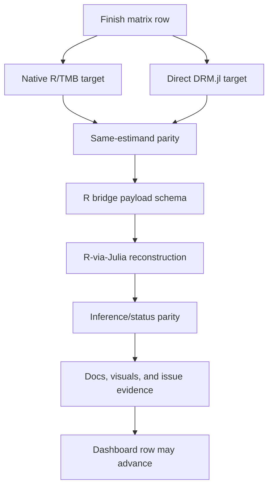

# R-Julia 100-Slice Finish Run

This note is the operating contract for the next 100 implementation slices
across `drmTMB`, the clean DRM.jl implementation worktree, and the R-to-Julia
bridge. It turns the finish matrix in
`docs/design/168-r-julia-finish-capability-matrix.md` into an auditable queue.

The queue is stored in
`docs/dev-log/dashboard/finish-100-slices.tsv`. Rows 1-10 are the truth-freeze
wave banked by this note and the dashboard validator. Rows 11-100 stay queued
until implementation, tests, docs, issue evidence, and dashboard state catch up.

## Claim Contract

The 100-slice run is not a release claim. A row can advance only when its native
R/TMB status, direct DRM.jl status, bridge status, inference status, tests,
documentation, visual evidence, and issue evidence agree for the same target.

The following boundaries remain hard:

- REML and AI-REML wording is exact-Gaussian-only.
- q4 Patterson-Thompson REML is not HSquared AI-REML.
- Bridge promotion requires row-specific native R, direct DRM.jl, and
  R-via-Julia parity evidence.
- No public Julia optimizer or `engine_control` surface is promoted.
- No interval coverage claim is made unless coverage is actually evaluated for
  that row.
- No q4, Laplace, or non-Gaussian AI-REML claim is allowed.
- No Ayumi-facing reply or issue comment is part of this run.
- No 10k sigma-phylo interval claim is allowed.

The parked Ayumi constraint is separate: after the 100-slice run, audit the
balanced `phylo_*` support story across location and scale axes before drafting
or posting anything to `Ayumi-495/LS_ecogeographical-rules#2`.

## Wave Order

1. **Truth freeze and run ledger.** Bank the 100-row queue, schema validation,
   bridge dependency graph, claim guardrails, and dashboard serving path.
2. **DRM.jl exact-Gaussian core.** Convert the location-only REML diagnostic
   lane from internal fixture evidence toward same-estimand comparator and
   optimizer-readiness evidence, without bridge promotion.
3. **Native R Gaussian/phylo.** Reconcile supported and unsupported native
   phylogenetic cells, especially location/scale neighbour cells, with tests and
   status rows.
4. **R-Julia bridge.** Add row-specific bridge payload and parity gates before
   relaxing any intentional R-side Julia rejection.
5. **Native non-Gaussian.** Harden non-Gaussian native evidence while keeping
   REML/AI-REML language out of Laplace and ML paths.
6. **Correlations and slopes.** Separate `rho12`, random slopes, bivariate
   covariance, q4, and q8 evidence.
7. **Structural dependencies.** Finish provenance, PSD/name-alignment,
   recovery, bridge, docs, and visuals for structural rows.
8. **Missing values.** Keep missing-data masks and bridge payloads explicit and
   separate from unrelated structural or non-Gaussian claims.
9. **Validation and benchmarks.** Standardize ADEMP, comparator, profile,
   bootstrap, runtime, and CI artifact rows.
10. **Public finish.** Synchronize README, ROADMAP, NEWS, pkgdown, Documenter,
    dashboard, release-gate audit, and recovery checkpoint.

## Bridge Dependency Graph

Any missing node keeps the row planned, partial, experimental, unsupported, or
intentional-error according to the current evidence. Green CI alone does not
advance a bridge row.

## First Ten Slices Banked Here

The first wave closes only the operating surface:

1. Dual-worktree status audit before edits.
2. Finish-matrix gap extraction from mission control.
3. Dashboard schema and validator source-map.
4. Bridge dependency graph.
5. Public claim guard list refresh for the 100-run.
6. R/Julia route vocabulary freeze.
7. CI target list for row advancement.
8. Dashboard stale-surface scan path.
9. Ayumi phylo-balance constraint parked for the later arc.
10. Check-log, after-task, dashboard, and validation sync.

These rows do not implement later package capabilities. They make the next 90
slices auditable.
