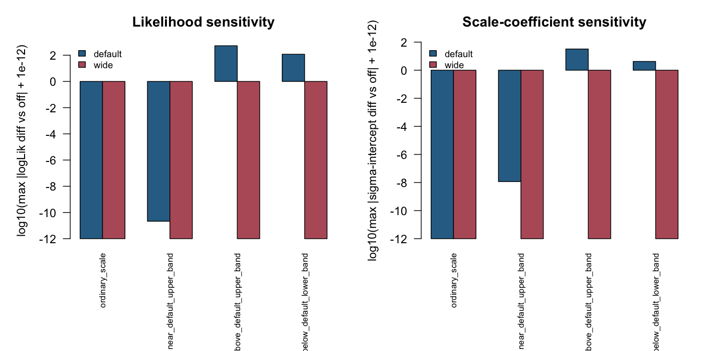

# log(sigma) clamp sensitivity pilot

This artifact banks the first numerical-guard sensitivity pilot for the
Gaussian `log(sigma)` soft-clamp. It responds to Hao Qin's 2026-06-16 concern
that hard-coded constants in the TMB template could force apparent convergence
or change inference without a statistical justification.

Interpretation label: `guard_sensitivity_pilot`. The evidence is intentionally
small and diagnostic. It supports two bounded statements:

- the default `log(sigma)` clamp is negligible in the audited fixed-effect cells
  when it is inactive;
- the default clamp can materially change a legitimate huge-scale fixed-effect
  Gaussian fit when the fitted scale lives outside the default band, so users
  need the exposed `drm_control(logsigma_clamp = ...)` knob and honest
  diagnostics.

It does not promote guard-dependent inference claims, scale-side phylogenetic
models, interval calibration, release readiness, or any Julia bridge claim.

## Provenance

- Source SHA before artifact generation:
  `9c6fd609e9f82fffc06686b193557889589e6ca9`
- Branch: `codex/guard-sensitivity-pilot`
- Package version: `drmTMB 0.1.4`
- R version: `R version 4.5.2 (2025-10-31)`
- Master seed: `20260617`
- Conditions: 4 fixed-effect Gaussian location-scale cells
- Replicates: 25 per condition
- Guard configurations: `off`, default `c(-12, 12)` with margin 3, and wide
  `c(-25, 25)` with margin 3
- Fit attempts: 300
- Dirty state after generation: this artifact directory only

The runner is committed as `run-pilot.R`. It uses `devtools::load_all(".", quiet
= TRUE)`, then fits:

```r
drmTMB(
  bf(y ~ x, sigma ~ x),
  data = dat,
  control = drm_control(logsigma_clamp = ...)
)
```

for each condition, replicate, and guard configuration. The conditions were
chosen with the ADEMP discipline from Morris, White & Crowther (2019) and the
transparent reporting checklist from Williams et al. (2024): ordinary scale,
large scale still inside the default identity band, legitimate huge scale above
the default band, and legitimate tiny scale below the default band.

## Files

- `run-pilot.R`: reproducible artifact runner.
- `logsigma-clamp-sensitivity-run-summary.csv`: one-row headline summary.
- `tables/logsigma-clamp-conditions.csv`: fixed-effect Gaussian DGP cells.
- `tables/logsigma-clamp-configs.csv`: guard configurations.
- `tables/logsigma-clamp-fits.csv`: one row per fit attempt.
- `tables/logsigma-clamp-comparisons.csv`: fit-level differences versus the
  unclamped reference within the same condition and replicate.
- `tables/logsigma-clamp-aggregate.csv`: condition-by-configuration summaries.
- `tables/logsigma-clamp-condition-summary.csv`: headline condition summaries.
- `figures/logsigma-clamp-sensitivity.png`: quick diagnostic plot.
- `session-info.txt`: R session information.



## Results

The run attempted 300 fits and returned 300 `ok` fits with no errors and no
captured warnings.

| Metric | Value |
| --- | ---: |
| Fit attempts | 300 |
| `ok` fits | 300 |
| Error rows | 0 |
| Maximum default-vs-off `logLik` difference when inactive | 2.046363e-11 |
| Maximum default-vs-off `sigma` intercept difference when inactive | 1.168681e-08 |
| Maximum wide-vs-off `logLik` difference across all cells | 0 |
| Maximum wide-vs-off `sigma` intercept difference across all cells | 0 |
| Maximum default-vs-off `logLik` difference when binding | 526.8952 |
| Maximum default-vs-off `sigma` intercept difference when binding | 32.38647 |

Condition-level summary:

| Condition | Default clamp active rate | Default convergence rate | Default pdHess rate | Max default-vs-off `logLik` diff | Max default-vs-off `sigma` intercept diff | Wide-vs-off `logLik` diff |
| --- | ---: | ---: | ---: | ---: | ---: | ---: |
| ordinary scale | 0.00 | 1.00 | 1.00 | 0 | 0 | 0 |
| near default upper band | 0.00 | 1.00 | 1.00 | 2.046363e-11 | 1.168681e-08 | 0 |
| above default upper band | 1.00 | 1.00 | 1.00 | 526.8952 | 32.38647 | 0 |
| below default lower band | 1.00 | 0.00 | 1.00 | 118.9206 | 4.205839 | 0 |

The wide configuration matches the unclamped reference in all four cells. The
default configuration is effectively identical to the unclamped reference in the
ordinary-scale and near-band cells, but it changes the fitted objective and
scale coefficients in the intentionally out-of-band huge-scale and tiny-scale
cells.

## Boundaries

This artifact covers only fixed-effect Gaussian location-scale models with
`sigma ~ x`. It does not test scale-side phylogenetic fields, random effects,
bivariate Gaussian scale routes, support floors in bounded-response likelihoods,
Student-t `nu > 2`, correlation open-interval guards, profile/bootstrap
intervals, or coverage. The broader numerical-guard simulation programme remains
active.

The correct user-facing rule is therefore:

```text
If the clamp is inactive, this pilot finds negligible impact in the audited
fixed-effect cells. If the clamp binds, the fit is guard-sensitive; widen or
disable the guard for legitimately huge unstandardized scales, and do not use a
guarded fit to upgrade convergence or inference claims.
```
