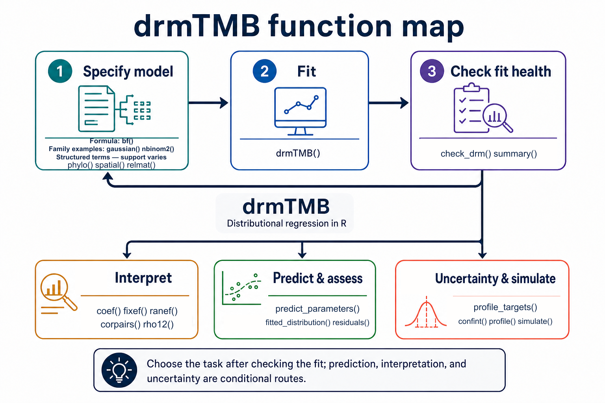

```{r, include = FALSE}
knitr::opts_chunk$set(collapse = TRUE, comment = "#>")
if (!"package:drmTMB" %in% search()) {
  library(drmTMB)
}
```

<style>
.drmtmb-function-map {
  display: block;
  inline-size: 100%;
  max-inline-size: 52rem;
  block-size: auto;
  margin: 1rem auto 1.25rem;
}
.drmtmb-route-note {
  margin: 0 0 1.5rem;
  padding: .8rem 1rem;
  border-left: 5px solid #147f88;
  border-radius: 8px;
  background: #f2f8f8;
}
.drmtmb-route-note p { margin: 0; }
.drmtmb-route-table {
  overflow-x: auto;
  -webkit-overflow-scrolling: touch;
}
.drmtmb-route-table table {
  min-inline-size: 46rem;
  margin-block-end: 0;
}
.drmtmb-downloads {
  display: grid;
  grid-template-columns: repeat(2, minmax(0, 1fr));
  gap: .8rem;
  margin: 1rem 0 1.5rem;
}
.drmtmb-download {
  padding: .85rem 1rem;
  border: 1px solid #cbdadd;
  border-radius: 10px;
  background: #f7fafb;
}
.drmtmb-download strong,
.drmtmb-download span { display: block; }
.drmtmb-download span {
  margin-top: .25rem;
  color: #526773;
  font-size: .92rem;
}
@media (max-width: 540px) {
  .drmtmb-downloads { grid-template-columns: 1fr; }
}
</style>

Use this guide when `drmTMB` is installed and you know the scientific task you
want to do next, but not which function starts it. For installation and a
guided first fit, read the fuller [package introduction](drmTMB.html). If you
already know the syntax and need to verify support, go directly to [What can I
fit today?](model-map.html).

This page is a navigation aid, not a claim that every displayed function,
family, structured effect, or interval route is suitable for every model.

`drmTMB` can model location (a family-specific centre or location parameter;
for Gaussian models it is the expected response), scale (residual
variability), shape (distribution features beyond location and scale), and
coscale, meaning residual correlation such as `rho12` between two responses.
Not every family exposes every parameter, and a location parameter need not be
the unconditional response mean.

## Find the next step

The ordinary route is **Specify model → Fit → Check fit health**. After checking
the fit, choose the branch that answers the scientific question: interpret
parameters, predict and assess, or quantify uncertainty and simulate. If the
fit is not healthy, revise the specification and fit again. Structured terms
such as `phylo()`, `spatial()`, and `relmat()` belong in the model
specification; they are not a later analysis stage. The `gaussian()` and
`nbinom2()` labels in the first box are examples of family constructors, not an
exhaustive family list.

```{r function-map, echo = FALSE, out.width = "100%", fig.class = "drmtmb-function-map", fig.align = "center", fig.alt = "Task-based drmTMB function map. The numbered primary route is Specify model, Fit, then Check fit health. Specify model includes bf(), family examples gaussian() and nbinom2(), and structured terms phylo(), spatial(), and relmat(), whose support varies. Fit uses drmTMB(). Check fit health uses check_drm() and summary(). After checking the fit, three unnumbered conditional branches lead to Interpret with coef(), fixef(), ranef(), corpairs(), and rho12(); Predict and assess with predict_parameters(), fitted_distribution(), and residuals(); or Uncertainty and simulation with profile_targets(), confint(), profile(), and simulate(). An arrow returns from Check fit health to Specify model when revision is needed."}

```

[Open the full-size function map](function-map-cheatsheet.png)
when reading on a small screen.

```{=html}
<div class="drmtmb-downloads" aria-label="Printable function-map downloads">
  <a class="drmtmb-download" href="../cheatsheets/drmTMB-function-map.pdf">
    <strong>Download the function map (PDF)</strong>
    <span>One-page landscape PDF using the audited map shown above.</span>
  </a>
  <a class="drmtmb-download" href="../cheatsheets/drmTMB-function-cheatsheet.pdf">
    <strong>Download the two-page function cheat sheet (PDF)</strong>
    <span>Two-page A4 landscape task and function reference, updated for drmTMB 0.7.0.</span>
  </a>
</div>
```

This HTML article is the accessible text alternative. The PDFs are untagged
print companions; screen-reader users should use the route table and linked
function descriptions on this page.

```{=html}
<div class="drmtmb-route-note" role="note">
  <p><strong>Typical route:</strong> Specify → Fit → Check. Interpretation,
  prediction, assessment, uncertainty, and simulation are conditional next
  tasks rather than compulsory stages.</p>
</div>
```

The **Predict & assess** branch checks fitted-response and fixed-effect
distributional form. It does not by itself establish adequacy of every random
or structured component; follow [Distributional outputs and
adequacy](distributional-outputs-and-adequacy.html) for that boundary.

## Choose a route

<div class="drmtmb-route-table" role="region" aria-label="Scrollable drmTMB task route table" tabindex="0">

| Goal | Start with | Read next |
| --- | --- | --- |
| Learn the model grammar and fit a first model | `bf()`, a family object, `drmTMB()` | [Full package introduction](drmTMB.html) |
| Check numerical fit health before interpreting | `check_drm()`, `summary()` | [Model workflow](model-workflow.html) |
| Resolve an error, warning, or unstable fit | `check_drm()`, the original warning, and the fitted object | [Errors, warnings, and convergence](convergence.html) |
| Extract a parameter or make a prediction table | `coef()`, `fixef()`, `predict_parameters()` | [Distributional outputs and adequacy](distributional-outputs-and-adequacy.html) |
| Study latent-normal association for a paired-outcome class listed in the association guide | `biv_associate()`, `association()`, `vcov()`, `confint()` | [Association between outcome pairs](cross-family.html) |
| Work with repeated, related, or spatially structured data | `bf()` with `phylo()`, `spatial()`, or `relmat()`; then `ranef()` | [Structural dependence overview](structural-dependence.html) |
| Request an interval or profile a target | `confint()`, `profile_targets()`, `profile()` | [Checking and using fitted models](model-workflow.html) |
| Fit when some values are missing | `miss_control()`, `mi()`, `imputed()` | [Handling missing data](missing-data.html) |
| Ask what a fitted model's objective is at some other parameter point, without refitting | `objective_at()`, `drm_control(start = ...)` | [Checking and using fitted models](model-workflow.html) |
| Confirm an unfamiliar route is supported | the model and capability guides | [What can I fit today?](model-map.html) |

</div>

## The shortest useful workflow

Suppose an ecologist asks whether an environmental gradient changes both mean
growth and its predictability. For a continuous response, write one formula
for location `mu` and one for residual scale `sigma`, then check the fit before
interpreting it.

```{r shortest-workflow}
set.seed(20260721)
n <- 80
x <- rnorm(n)
dat <- data.frame(
  y = 0.4 + 0.7 * x + rnorm(n, sd = exp(-0.3 + 0.2 * x)),
  x = x
)

fit <- drmTMB(
  bf(y ~ x, sigma ~ x),
  family = gaussian(),
  data = dat
)

check_drm(fit)
coef(fit, dpar = "mu")
coef(fit, dpar = "sigma")
```

Here `mu` is expected growth and `sigma` is residual SD. The `sigma`
coefficients use a log-SD link: exponentiating the slope gives the residual-SD
ratio per one-unit increase in `x`. Keep this residual scale separate from the
SD of a group-level random effect.

Make response-scale predictions on an explicit grid:

```{r coefficient-and-prediction}
coef(fit, dpar = "mu")
coef(fit, dpar = "sigma")

grid <- data.frame(x = c(-1, 0, 1))
predict_parameters(
  fit,
  newdata = grid,
  dpar = c("mu", "sigma"),
  conf.int = TRUE
)
```

The prediction table records interval provenance in `conf.status` and
`interval_source`. If `check_drm()` reports a warning or error, or an interval
status is unavailable, follow [Errors, warnings, and
convergence](convergence.html) before reporting the result. A fixed-effect
Wald interval does not establish calibrated coverage for a random-effect SD.

If fitting stops before an object is returned, read the original error and
confirm the exact family-component combination in [What can I fit
today?](model-map.html). If a fit object is returned, run `check_drm(fit)`,
address the flagged optimizer, gradient, Hessian, or design problem, then refit
and rerun the check before interpreting.

## Keep the boundaries visible

`drmTMB()` is the primary R workflow shown here. Julia fitting remains
future/deferred work; the current Julia methods provide compatibility for
legacy Julia-engine objects and are not a route for a new analysis.

This page chooses a route; it does not establish a claim tier. Before a
substantive analysis, confirm the exact family, model component, and inference
boundary in [What can I fit today?](model-map.html) and [What can I
trust?](capability-and-limits.html).
If the exact combination is absent or marked planned or diagnostic-only, do
not treat a successful fit as supported inference; choose an implemented route
or report the limitation.
