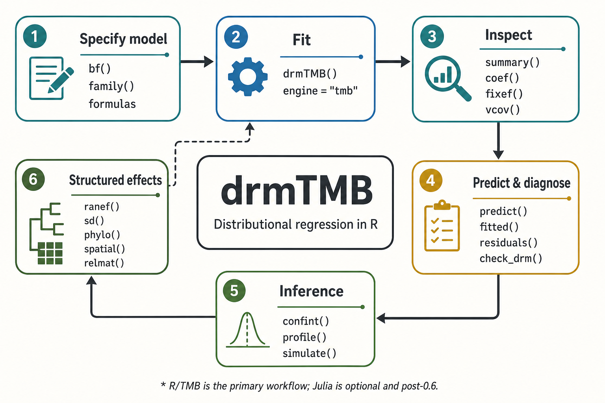

```{r, include = FALSE}
knitr::opts_chunk$set(collapse = TRUE, comment = "#>")
if (!"package:drmTMB" %in% search()) {
  library(drmTMB)
}
```

Use this page when you know the scientific question but need to find the
smallest useful `drmTMB` workflow. It is a map, not a capability ledger: use
[What can I fit today?](model-map.html) before relying on an unfamiliar
random-effect or inference route.

```{r function-map, echo = FALSE, out.width = "100%", fig.alt = "Six-step drmTMB function map. Specify a model with bf(), family(), and formulas; fit with drmTMB() using the native TMB engine; inspect with summary(), coef(), fixef(), and vcov(); predict and diagnose with predict(), fitted(), residuals(), and check_drm(); use confint(), profile(), and simulate() for inference; and add structured effects with ranef(), sd(), phylo(), spatial(), and relmat(). The Julia bridge is halted/deferred future work, so this map uses the native R/TMB workflow only."}

```

## Quick reference

| Goal | Start with | Read next |
| --- | --- | --- |
| Specify and fit a first model | `bf()`, a family object, `drmTMB()` | [Getting started](drmTMB.html) |
| Decide whether the fit is interpretable | `check_drm()`, `summary()` | [Model workflow](model-workflow.html) |
| Extract a parameter or make a prediction table | `coef()`, `fixef()`, `predict_parameters()` | [Distributional outputs and adequacy](distributional-outputs-and-adequacy.html) |
| Work with repeated, related, or spatially structured data | `ranef()`, `phylo()`, `spatial()`, `relmat()` | [Structural dependence overview](structural-dependence.html) |
| Request an interval or profile a target | `confint()`, `profile_targets()`, `profile()` | [Checking and using fitted models](model-workflow.html) |
| Fit when some values are missing | `miss_control()`, `mi()`, `imputed()` | [Handling missing data](missing-data.html) |
| Confirm an unfamiliar route is supported | `model-map` and `capability-and-limits` | [What can I fit today?](model-map.html) |

## The shortest useful workflow

For a continuous response whose expected value and residual variability may
both depend on `x`, write one formula for `mu` and one for `sigma`, fit with
the default TMB engine, and check the result before interpretation.

```{r shortest-workflow}
set.seed(20260721)
n <- 80
x <- rnorm(n)
dat <- data.frame(
  y = 0.4 + 0.7 * x + rnorm(n, sd = exp(-0.3 + 0.2 * x)),
  x = x
)

fit <- drmTMB(
  bf(y ~ x, sigma ~ x),
  family = gaussian(),
  data = dat
)

check_drm(fit)
summary(fit)
```

Here `mu` is the expected response and `sigma` is the residual standard
deviation. The `sigma` coefficients are on a log-SD scale, so use
[Which scale are you modelling?](which-scale.html) before treating them as
variance or group-level effects.

## Detailed function reference

| When you need to... | Start with | Then go to |
| --- | --- | --- |
| State which distributional parameters have formulas | `bf()` or `drm_formula()` | [Formula grammar](formula-grammar.html) |
| Choose a likelihood for continuous, count, proportion, ordinal, or robust data | `gaussian()`, `nbinom2()`, `beta()`, `cumulative_logit()`, `student()`, or another family object | [Choosing response families](distribution-families.html) |
| Fit the model | `drmTMB()` | [Getting started](drmTMB.html) |
| Check convergence and boundary warnings | `check_drm()` | [Improving convergence](convergence.html) |
| Read fixed effects and their covariance | `summary()`, `coef(fit, dpar = "mu")`, `fixef()`, `vcov()` | [Model workflow](model-workflow.html) |
| Extract group-level or structured effects | `ranef()`, `structured_effects()`, `corpairs()` | [Structural dependence overview](structural-dependence.html) |
| Predict one or more distributional parameters on a covariate grid | `predict_parameters()` | [Distributional outputs and adequacy](distributional-outputs-and-adequacy.html) |
| Inspect fitted rows or residuals | `fitted()`, `residuals()`, `fitted_distribution()` | [Distributional outputs and adequacy](distributional-outputs-and-adequacy.html) |
| Check distributional adequacy | `worm_plot()`, `qq_plot()`, `centile_chart()`, `exceedance()` | [Distributional outputs and adequacy](distributional-outputs-and-adequacy.html) |
| Request an interval or inspect profile targets | `confint()`, `profile_targets()`, `profile()` | [Checking and using fitted models](model-workflow.html) |
| Simulate from the fitted model | `simulate()` | [Checking and using fitted models](model-workflow.html) |

`coef(fit)` returns a named list, one numeric block per fitted distributional
parameter. Select a block explicitly when writing analysis code:

```{r coefficient-and-prediction}
coef(fit, dpar = "mu")
coef(fit, dpar = "sigma")

grid <- data.frame(x = c(-1, 0, 1))
predict_parameters(
  fit,
  newdata = grid,
  dpar = c("mu", "sigma"),
  conf.int = TRUE
)
```

The returned prediction table records its interval provenance in
`conf.status` and `interval_source`. A Wald interval for a fixed-effect
prediction is not automatically an interval for a random-effect SD or a
general claim of calibrated coverage.

## Common routes

### Counts, proportions, and robust continuous responses

Keep the model workflow above, but replace the family object and use the
matching parameter names. For example, `nbinom2()` adds an NB2 dispersion
parameter, beta-family models use `mu` and `sigma`, and zero-one beta also
uses `zoi` and `coi` for exact boundary mass. The
[family guide](distribution-families.html) gives the parameterization and the
worked syntax for each route.

### Two responses and residual correlation

For a bivariate Gaussian model, name the two location formulas and the
residual-correlation formula explicitly. `rho12` is residual coupling after
the response-specific means and residual scales are modelled; it is not a
group-level or phylogenetic correlation.

```r
set.seed(20260722)
pair_dat <- data.frame(x = rnorm(120))
pair_dat$y1 <- 0.5 + 0.6 * pair_dat$x + rnorm(120, sd = 0.7)
pair_dat$y2 <- -0.2 + 0.4 * pair_dat$x + rnorm(120, sd = 0.8)

fit_biv <- drmTMB(
  bf(mu1 = y1 ~ x, mu2 = y2 ~ x, rho12 = ~ x),
  family = biv_gaussian(),
  data = pair_dat
)

rho12(fit_biv)
corpairs(fit_biv)
```

Read [Changing residual coupling with `rho12`](bivariate-coscale.html) before
interpreting bivariate correlation layers.

### Repeated groups, phylogeny, space, and relatedness

Random and structured terms change the estimand. A term such as `(1 | id)`
models ordinary among-group variation; `phylo()`, `spatial()`, `animal()`, and
`relmat()` use supplied structure. Their fitted and inference-backed surfaces
are deliberately narrower than the fixed-effect surface, so check the
[capability and limits page](capability-and-limits.html) for the exact family,
parameter, and evidence boundary.

## Keep the boundaries visible

`engine = "tmb"` is the current workflow. The Julia bridge is halted/deferred
future work: it is not required to fit, diagnose, or report the R/TMB models
shown here, and it is not an alternate engine for a new analysis.

This sheet helps you choose a first function, not a claim tier. Before a
substantive analysis, confirm the supported syntax and inference boundary in
[What can I fit today?](model-map.html) and [What can I trust?](capability-and-limits.html).
